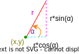

# Riadny termín \[60b], 26.05.2022 10:00
B-OOP 2022

Vytvorte oknovú aplikáciu, ktorá umožní používateľovi kresliť čiary pomocou korytnačky (niečo na štýl programu Imagine). Aplikácia bude mať nasledovnú funkcionalitu (40 bodov):

1. Vytvorenie hlavného okna, ktoré bude obsahovať funkčné Ovládacie prvky a Kresliacu plochu \[10b].
2. Správny tvar korytnačky \[5b].
3. Posun korytnačky pomocou akcie v menu \[10b].
4. Posun korytnačky pomocou klávesnice \[10b].
5. Voľba farby čiary prostredníctvom [JButton](https://docs.oracle.com/en/java/javase/11/docs/api/java.desktop/javax/swing/JButton.html) \[4b].
6. Zatvorenie aplikácie cez tlačidlo na zatvorenie aplikácie poskytnuté operačným systémom \[1b].

## Podrobný popis k bodu 1:

Väčšinu plochy okna bude zaberať Kresliaca plocha. V dolnej časti okna sa budú nachádzať Ovládacie
prvky. Ovládacie prvky budú tvoriť:
1. [JCombobox](https://docs.oracle.com/en/java/javase/11/docs/api/java.desktop/javax/swing/JComboBox.html) ktorý bude slúžiť na zmenu uhlu pohybu korytnačky, pričom možné ulhy sú (v stupňoch): {0, 5 ,10, 45, 90 , 180}, počiatočný je 45,
2. [JSlider](https://docs.oracle.com/en/java/javase/11/docs/api/java.desktop/javax/swing/JSlider.html) ktorý bude slúžiť na zmenu veľkosti kroku korytnačky , pričom slider je nastavený od 0 po 100 s krokom 10, 10 je počiatočný stav,
3. [JButton](https://docs.oracle.com/en/java/javase/11/docs/api/java.desktop/javax/swing/JButton.html) “Akcia”, ktorý vykoná pohyb korytnačky o vybraný uhol a krok,
4. [JLabel](https://docs.oracle.com/en/java/javase/11/docs/api/java.desktop/javax/swing/JLabel.html) ktorý ukazuje aktuálne zvolenú velkosť kroku a uhol korytnačky,
5. [JButton](https://docs.oracle.com/en/java/javase/11/docs/api/java.desktop/javax/swing/JButton.html) "Farba", ktorý vykoná zmenu farby čiary, ktorú bude najbližšie korytnačka kresliť,
6. [JLabel](https://docs.oracle.com/en/java/javase/11/docs/api/java.desktop/javax/swing/JLabel.html) ktorý ukazuje aktuálne zvolenú farbu

Každý z týchto prvkov musí zaberať šestinu celkového miesta vyhradeného pre ovládacie prvky (napr. Grid 2x3).

## Podrobný popis k bodu 2:

Korytnačka si pamätá svoju aktuálnu polohu na kresliacej ploche a svoju rotáciu. Bod, ktorý určuje polohu korytnačky, ako aj stred jej otáčania sú totožné a nachádzajú sa v strede jej panciera. Hlava korytnačky musí byť vykreslená tak aby zobrazovala jej aktuálny uhol otočenia (keď sa korytnačka pozerá hore, tak hore, keď doprava tak v pravo, a rovnako pre ľubovoľný uhol).

Korytnačka sa skladá z dvoch kruhov, kedy stred panciera je v bode v ktorom sa korytnačka nachádza a stred jej hlavy je na obvode panciera. Rozmery, farbu aj to, či sa hlava kresly nad alebo pod pancier si môžete zvoliť sami, musí však byť možné rozoznať ktorá časť je hlava, ktorá je pancier, ako aj otočenie korytnačky.

Počiatočná pozícia korytnačky by mala byť približne v strede kresliacej plochy a korytnačka by mala byť otočená smerom hore, tj. ak mám okno 700x700, z čoho ovládací panel má cca 200, tak sa korytnačka musí nachádzať cca na pozícii (350; 250).

## Podrobný popis k bodu 3:

Stlačením tlačidla Akcia sa má vykonať otočenie korytnačky o zvolený uhol a posun dopredu o zvolený krok. Svojím posunom korytnačka v danom smere nakreslí čiaru aktuálne zvolenou farbou. Čiara smeruje zo starej pozície korytnačky na jej novú pozíciu (stred panciera). Čiara sa kreslí vždy *POD* korytnačku.

## Podrobný popis k bodu 4:

Korytnačka sa má vedieť pohybovať aj pomocou stlačenia kláves, konkrétne šípiek.
Stlačením šípky hore sa má korytnačka posunúť o zvolený krok dopredu a nakresliť čiaru (ako je uvedené v bode 3).
Stlačením šípky dole sa má korytnačka posunúť o zvolený krok dozadu a nakresliť čiaru.
Stlačením šípky doľava sa má korytnačka otočíť o zvolený uhol doľava,
Stlačením šípky doprava sa má korytnačka otočiť o zvolený uhol doprava.

## Podrobný popis k bodu 5:

Spomedzi ovládacích prvkov bude Button "Farba" slúžiť na výber farby a Label na grafické znázornenie aktuálne  zvolenej farby. Program umožňuje zvoliť minimálne 3 farby v nejakom fixnom poradí (napr. červená > modrá > zelená). Tlačidlom sa aktívna farba zmení na nasledujúcu farbu v poradí. Pokiaľ sa v zozname farieb nachádzame na poslednom prvku, tak za ním nasleduje opäť prvá farba (t.j. červená > modrá > zelená > červená > ...). Pri spustení aplikácie je automaticky zvolená jedna z týchto farieb. Práve kreslené čiary majú farbu zvolenú podľa aktuálnej farby. Farby môžu byť ľubovoľné, podmienkou ale je, aby boli viditeľné na kresliacej ploche. Po výbere farby sa zmení text Label-u podľa aktuálnej farby. Zmena farby ovplyvňuje len nové čiary, už nakreslené čiary si musia zachovať svoju farbu!

## Opakovanie trigonometrie

Trigonometrické funkcie sa nachádzajú ako statické metódy v triede `Math` (`Math.sin()`, `Math.cos()`) a berú ako argument uhol v *RADIÁNOCH*.

Prevod stupňov na radiány a opačne je možný pomocou metód `Math.toDegrees()` a `Math.toRadians()`. Pripomíname, že 360° = 2π radiánov. Ak by ste potrebovali hodnotu cisla π, tak použite konštantu `Math.PI`.

Keď mám bod v súradniciach `(x, y)` a mám z neho čiaru dlhú `r` pod uhlom `α`, tak rozdiel *Y* súradníc začiatočného a koncového bodu tejto čiary viem vypočítať ako `r * sin(α)` a rozdiel *X* súradníc týchto dvoch bodov viem vypočítať ako `r * cos(α)`. Tento vzorec je správny pre ľubovoľný uhol α (aj záporný aj väčší ako 2π).

Pozor! Súradnicová sústava displeja je iná ako klasickej súradnicovej osi, pretože *Y* stúpa smerom nadol. Uhol 0 vyjadrený relatívne ku osi *X* zodpovedá otočeniu doprava. Uhol 90° (π/2) odpovedá otočeniu dole!

## Hodnotenie

Projekt obsahuje github pipeline, ktorá kontroluje skompilovateľnosť programu. **Pokiaľ program nie je skompilovateľný nebude hodnotený a skúška bude hodnotená 0b!**

**Pokiaľ budete počas skúšky pristihnutý pri podvádzaní, alebo bude váš kód vykazovať príliš veľkú podobnosť s kódom iných študentov, bude skúška hodnotená 0 bodmi!**

Okrem funkcionality budú hodnotené aj princípy Objektovo orientovaného programovania (20 bodov), budeme hodnotit približne rovnaké veci ako pri druhom zadaní, pre istotu uvádzame niektoré z nich:

* správne modifikátory prístupu,
* vhodné pomenovanie tried a metód,
* vhodné využitie dedenia a polymorfizmu
* vhodné použitie výnimiek na ošetrenie nedovoleného správania (nehádzať a nezachytávať všeobecnú triedu Exception),
* stavové premenné ako int alebo String,
* duplicitný kód,
* unused kód,
* nedodržanie konvencií,
* použitie keyStroke,
* použitie vnorených tried (nested class),
* použitie statických metód alebo nekonštantných statických premenných,
* celá aplikácia naprogramovaná v jednej triede,
* inicializacia atributov triedy pri ich vytvoreni,
* kontrola kláves bez java konštánt (VK_),
* vykreslovanie textu cez kresliacu plochu,
* keyListener prestane fungovať po stlačení niečoho v menu,
* Null layout

Za každy nedostatok vám možu byť strhnuté cca 3-4 body.

Pokiaľ vaše riešenie neobsahuje dostatok implementácie je možné za OOP získať maximálne [10b].

## Odovzdanie

Vypracovanie skúšky odovzdajte cez Github classroom vykonaním commit a push zdrojového kódu do vášho repozitára v skupine Interes-Group (tak ako na zadaniach). Hodnotí sa posledný pushnutý commit pred časom ukončenia skúšky (bude oznámený po začatí skúšky). Odovzdáva sa obsah celého projektu. Na vypracovanie písomky je vyhradený čas 3 hodiny.

---------------------------------------------------------------------------------------

# Exam RT \[60b], 26.05.2022 10:00
B-OOP 2022

Your task is to create a java window application. The application allows the user to draw lines with a turtle (something like the program "Imagine"). The application has the following functionality (40 points):

1. Creation of the main window, that will contain control elements and a drawing area \[10b].
2. Correct shape of the turtle \[5b].
3. Moving the turtle with Action button in menu \[10b].
4. Moving the turtle with keyboard inputs \[10b].
4. Selection of the drawing color through a [JButton](https://docs.oracle.com/en/java/javase/11/docs/api/java.desktop/javax/swing/JButton.html) \[4pts].
5. Closing the application with the "close window" button provided by the operating system \[1pt].

## Description for bullet point 1:
Most of the window area will be covered by the drawing area. The bottom part of the window will contain the control elements. The control elements consist of:
1. [JCombobox](https://docs.oracle.com/en/java/javase/11/docs/api/java.desktop/javax/swing/JComboBox.html) which changes the movement angle of the turtle, possible angles are (in degrees): {0, 5 ,10, 45, 90 , 180}, initial is 45,
2. [JSlider](https://docs.oracle.com/en/java/javase/11/docs/api/java.desktop/javax/swing/JSlider.html) which will be for changing the length of the line the turtle draws, slider values are from 0 to 100 with step 10, 10 is the initial state,
3. [JButton](https://docs.oracle.com/en/java/javase/11/docs/api/java.desktop/javax/swing/JButton.html) “Action”, which will rotate the turtle by the selected angle and move the turtle forward by the selected distance,
4. [JLabel](https://docs.oracle.com/en/java/javase/11/docs/api/java.desktop/javax/swing/JLabel.html) which displays the currently selected distance and angle of the turtle,
5. [JButton](https://docs.oracle.com/en/java/javase/11/docs/api/java.desktop/javax/swing/JButton.html) "Color", which changes the color of the lines, that will be drawn by the turtle when it moves,
6. [JLabel](https://docs.oracle.com/en/java/javase/11/docs/api/java.desktop/javax/swing/JLabel.html) which displays the currently selected color

Each of these elements must take up a sixth of the available space (eg. Grid 2x3).

## Description for bullet point 2:

The turtle remembers its position on the drawing area, and its rotation. The point that specifies the position of the turtle and the point that the turtle rotates around are the same point, and it is located in the center of the turtles shell. The head of the turtle must be drawn in such a way, that it mimics its current rotation (if the turtle is rotated upwards then up, if it is rotated to the left, then left and similarly for any angle).

The turtle consists of two circles, the center of its shell is located at the position of the turtle and the center of its head is on the perimeter of the shell. The dimensions, colors and whether the head is drawn behind or in front of the shell is up to you, it must be clear however, which part is the shell, which part is the head and which way is the turtle looking.

The initial position of the turtle should be roughly in the center of the drawing area and the turtle should be facing upwards, that is if the windows is 700x700, and the control panel is 200 high, then the turtle should be roughly at the position (350; 250).

## Description for bullet point 3:

When you press the "Action" button, the turtle should rotate by the selected angle to the right and then move forward by the selected distance. By moving forward the turtle draws a line with the selected color. The line starts at the previous location of the turtle and ends at its new location (center of the shell). The lines are always drawn *UNDER* the turtle.

## Description for bullet point 4:

The turtle is able to move with the help of the arrow keys.
By pressing the UP arrow key, the turtle moves by the selected distance forward and draws a line (as specified in point 3).
By pressing the DOWN arrow key, the turtle moves by the selected distance forward and draws a line.
By pressing the LEFT arrow key, the turtle turns to the left by the selected angle.
By pressing the RIGHT arrow key, the turtle turns to the right by the selected angle.

## Description for bullet point 5:

The "Color" button switches the currently selected color and the associated label displays what color is selected. The application allows the selection of at leas 3 colors in som fixed order (eg. red > blue > green). By pressing the button the selected color changes to the next in the sequence. If the last color is selected, then the button changes it to the first (i.e. red > blue > green > red > ...). At the start of the application one of the colors is selected by default. Any new lines are drawn with the currently selected color. You can freely choose the colors, but they must be visible on the drawing area. When the color changes the text of the label that displays it changes accordingly. Changing the color affects only future lines, the existing lines are always drawn with their original color!

## Trigonometry cheat-sheet

Trigonometric functions are available as static methods of the `Math` class (`Math.sin()`, `Math.cos()`) and take the angle in *RADIANS* as an argument.

Transforming an angle from degrees to radians and back can be done with the `Math.toDegrees()` and `Math.toRadians()` methods. Reminder: 360° = 2π radians. Should you need the value of π use the `Math.PI` constant.

If I have a point at `(x, y)` where a line of length `r` and angle `α` originates, then the difference of the *Y* coordinate of the starting point and end point of the line can be calculated as `r * sin(α)` and the difference of the *X* coordinate of these two points can be calculated as `r * cos(α)`. This calculation is correct for any angle α (even negative or greater than 2π).

Be careful! The coordinate system of the screen is different from the classical system of X and Y axes. On a screen the *Y* coordinate increases downwards. An angle of 0 relative to the *X* axis expresses a rotation facing to the right. An angle of 90° (π/2) expresses a rotation facing downwards!

## Grading

The project contains a github pipeline, that checks whether it can be compiled or not. **If the program cannot be compiled it will not be graded and 0 points will be received for the exam!**.

**If you are caught cheating during the exam, or if the source code handed in by you will have a suspicious amount of similarities with the code of other students 0 points will be received for the exam!**

Appart from the functionality, the principles of Object-Oriented Programming will be graded as well (20 pts), pay close attention especially to:

* correct access modifiers,
* appropriate naming of classes and methods,
* appropriate use of inheritance and polymorphism,
* appropriate use of exceptions for handling illegal behavior (do not throw or catch the generic Exception class),
* usage of int or String state variables,
* duplicate code,
* unused code,
* usage of the java language conventions,
* usage of keyStroke,
* usage of nested classes,
* usage of static methods or non-final static variables,
* the entire application being coded in one class,
* initialisation of class attributes at declaration,
* comparing key codes without the java constants (VK_),
* drawing text over the drawing area,
* keyListener stops working when a menu element is clicked,
* Null layout

For each mistake you may lose around 3-4 points.

If your solution does not contain enough implementation you may get at most [10 pts] for OOP.

## Handing in the assigment

Hand in the assignment into your Github classroom repository located under the Interes-Group for this exam. Hand in the entire project. You have 3 hours to complete the exam.